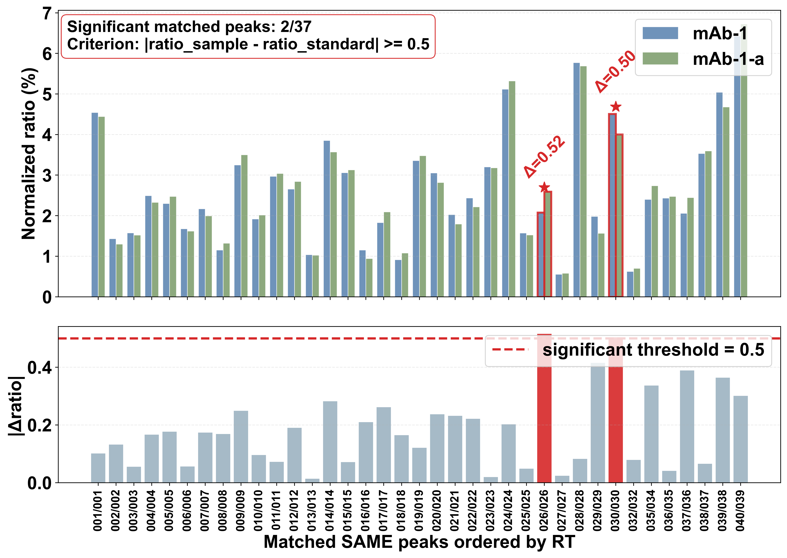

# PPMe

**PPMe** (Peptide Mapping evaluation) is a command-line toolkit for peptide mapping comparison and classification. It consists of two complementary scripts:

| Script | Role |
|--------|------|
| `evaluate.py` | One-to-one peak matching under a retention-time (RT) tolerance using the Hungarian algorithm; quantifies pairwise sample similarity |
| `judge.py` | A PyTorch Siamese network that learns difference patterns between a standard and labeled classes (a/b/c/d), classifies a new sample, and reports the same similarity metric and visualizations as `evaluate.py` |

Inputs are peptide-peak tables (`rt` + `ratio`) in `.csv` / `.xlsx`.

### Application scenarios

- **Biosimilar / recombinant protein comparability**: Compare candidate batches against a reference standard; report similarity and DIFF peak lists
- **Process and lot-to-lot consistency**: Quantitatively compare maps across lots of the same product; flag DIFF peaks and ratio outliers
- **Forced degradation / variant typing**: Train a classifier on known variant or degradation classes (e.g., a/b/c/d) and predict class labels and probabilities for unknowns
- **Method development and QC support**: Standardize peak matching under a fixed RT tolerance to produce traceable figures and text reports for method validation or release review
- **Cross-protein / multi-standard studies**: Organize standard–sample pairs via a training manifest to learn difference patterns under multiple protein contexts

## Environment

Python ≥ 3.10 is recommended.

```bash
python -m pip install -r requirements.txt
python -m pip install torch
```

For GPU installs, follow the command for your CUDA version from the [PyTorch website](https://pytorch.org/). `judge.py` requires `torch`; significance stars on the classification plot also require `scipy`.

---

## Input data

Each sample file must contain at least two columns:

- `rt`: retention time (minutes)
- `ratio`: peak-area proportion

Column names can be set with `--rt-col` and `--ratio-col`; Excel sheets with `--sheet` (default `Sheet1`).

### Example

| rt | ratio |
|----------|----------|
| 18.042... | 2.14... |
| 20.151... | 1.10... |
| 22.559... | 2.38... |
| 23.926... | 1.39... |
| ... | ... |

---

## Usage

### 1. `evaluate.py`: pairwise similarity

Under RT tolerance `--delta-min`, PPMe finds a globally optimal one-to-one SAME matching via the Hungarian algorithm, scores ratio differences into a similarity (0–100), and writes a SAME/DIFF figure plus a DIFF peak list.

**Basic usage**

```bash
python evaluate.py protein1.xlsx protein2.xlsx --delta-min number
```

**Example**

```bash
python evaluate.py protein1.xlsx protein2.xlsx ^
  --delta-min 0.2 ^
  --rt-col rt ^
  --ratio-col ratio ^
  --min-ratio 0.5 ^
  --save-plot same_diff_judgement.png ^
  --save-diff-txt diff_peaks.txt ^
  --significant-ratio-diff 0.5 ^
  --high-similarity-threshold 85 ^
  --save-significant-plot significant_ratio_comparison.png
```

| Argument | Description |
|----------|-------------|
| `protein1_file`, `protein2_file` | Two peak tables to compare |
| `--delta-min` | RT tolerance in minutes (required) |
| `--min-ratio` | Drop low-abundance peaks, then renormalize ratios to 100 (default 0) |
| `--save-plot` | Path for the SAME/DIFF figure |
| `--save-diff-txt` | Path for the DIFF peak summary |
| `--significant-ratio-diff` | Optional extra plot for matched peaks with large ratio differences when similarity is high |
| `--high-similarity-threshold` | Similarity cutoff to trigger the significant-ratio plot (default 80) |
| `--save-significant-plot` | Output the significant-ratio plot |

> **SAME / DIFF peak-matching visualization**  
> 

> **High-similarity significant ratio-difference plot (optional)**  
> 

---

### 2. `judge.py`: train a classifier and predict sample class

Train a Siamese classifier on standard–sample pairs, assign an unknown `sample` to one of a/b/c/d, compute standard–sample similarity, and export probabilities, DIFF lists, and classification plots.

#### Training data layout

**Option A: root folder with subfolders `a/` `b/` `c/` `d/`**

```text
train_data/
  a/ ...
  b/ ...
  c/ ...
  d/ ...
```

```bash
python judge.py --standard-file standard.xlsx --train-root train_data --val-root val_data --sample-file sample.xlsx
```

**Option B: four classes directories**

```bash
python judge.py --standard-file standard.xlsx ^
  --train-a-dir train_data/a --train-b-dir train_data/b --train-c-dir train_data/c --train-d-dir train_data/d ^
  --val-a-dir val_data/a --val-b-dir val_data/b --val-c-dir val_data/c --val-d-dir val_data/d ^
  --sample-file sample.xlsx
```

**Option C: cross protein pairs**

Required columns: `standard_file`, `sample_file`, `label` (`label` ∈ a/b/c/d).

```bash
python judge.py --train-root train_data --val-root val_data --sample-file sample.xlsx --standard-file standard.xlsx
```

#### Train only

```bash
python judge.py --standard-file standard.xlsx --train-root train_data  --val-root val_data --model-path model.pt
```

#### Predict only

```bash
python judge.py --standard-file standard.xlsx --sample-file sample.xlsx --model-path model.pt
```

#### Train + predict example

```bash
python judge.py ^
  --standard-file standard.xlsx ^
  --train-root train_data ^
  --val-root val_data ^
  --sample-file sample.xlsx ^
  --delta-min 0.2 ^
  --min-ratio 0.5 ^
  --device cuda ^
  --model-path model.pt
```

**Primary inputs & outputs**

| Argument | Description |
|----------|-------------|
| `--standard-file` | The file name of the standard file |
| `--sample-file` | The file name of the sample file |
| `--train-root` | Folder containing subfolders a/b/c/d for single-standard training |
| `--val-root` | Folder containing subfolders a/b/c/d for single-standard validation |
| `--model-path` | Path for the model (saving path or applying path) |
| `--dropout` | Dropout probability for encoder/head (default 0.25) |
| `--label-smoothing` | Label smoothing for cross-entropy (default 0) |
| `--reduce-lr-factor` | Factor to reduce LR on plateau (default 0.5) |
| `--reduce-lr-patience` | ReduceLROnPlateau patience (default 3)  |
| `--min-lr` | Minimum LR after reductions (default 1e-6) |
| `--early-stopping-patience` | Early stopping patience in epochs (default 10) |
| `--epochs` | Default 300 |
| `--batch-size` | Default 16 |
| `--lr` | Default 1e-3 |
| `--weight-decay` | Default 1e-4 |
| `--contrastive-weight` | Default 0.2 |
| `--temperature` | Default 0.2 |
| `--val-ratio` | Default 0.25 |
| `--seed` | The seed of training |

| File (default name) | Content |
|---------------------|---------|
| `judge_siamese.pt` | Trained model checkpoint |
| `judge_prediction.txt` | Predicted class, similarity, class probabilities |
| `judge_same_diff_judgement.png` | Standard–sample peak-matching figure |
| `judge_diff_peaks.txt` | DIFF peak list |
| `judge_sample_classification.png` | Class probabilities vs. group similarity summary |
| `judge_similarity_summary.txt` / `judge_group_similarity.png` | Per-group similarity summary on the training set |

---

## Typical workflow

1. Use `evaluate.py` with a known RT tolerance to compare two peptide maps and obtain similarity and DIFF peaks.
2. Prepare labeled a/b/c/d training data and train with `judge.py`.
3. For a new sample: load the model, then export class, probabilities, standard–sample similarity, and figures.

Similarity in `evaluate.py` and `judge.py` follows the same logic.

---

## More information

The model `mAb-1.pt` has been fully trained and is now ready for deployment. Our team will conduct continuous improvements and updates on this model.
For any questions, issues, or suggestions, please contact hsongzhe@163.com or open an issue in the repository. We will review and address them as promptly as possible.

---

## Citation

If you use PPMe in your work, please cite:

> Fang JT, Wang ST, Wang H, Fang WJ. A Novel Peptide Mapping Method Utilizing Cysteine as a Reducing Agent. Pharm Res. 2025 Jan;42(1):173-184. doi: 10.1007/s11095-024-03805-z. Epub 2025 Jan 23. PMID: 39849215.
